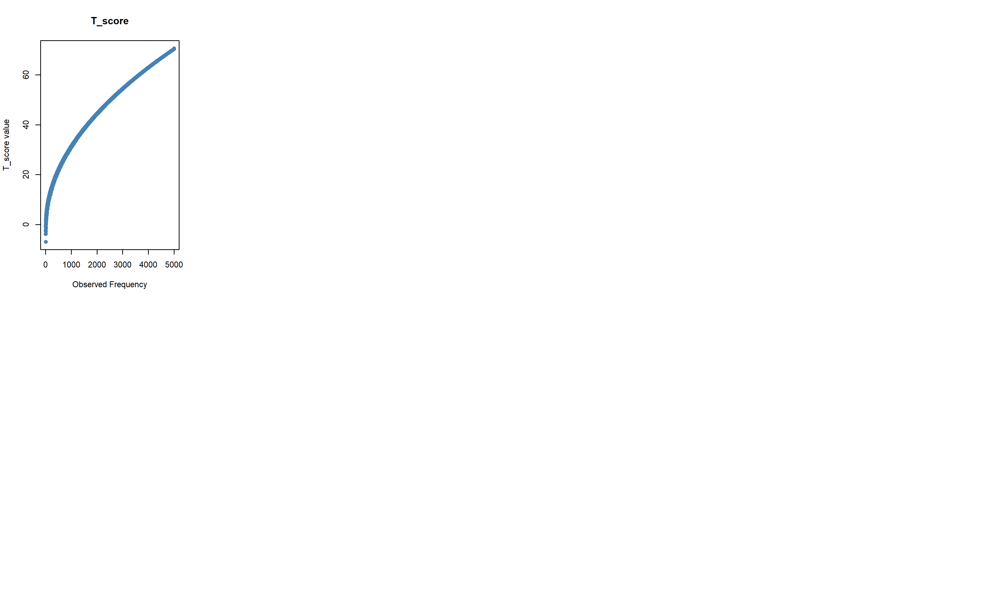
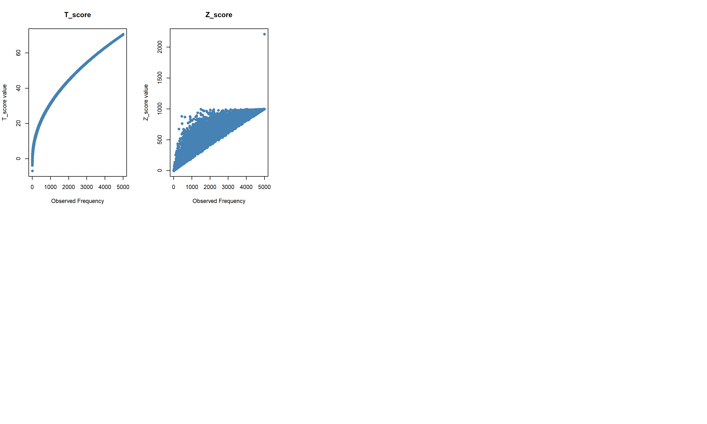
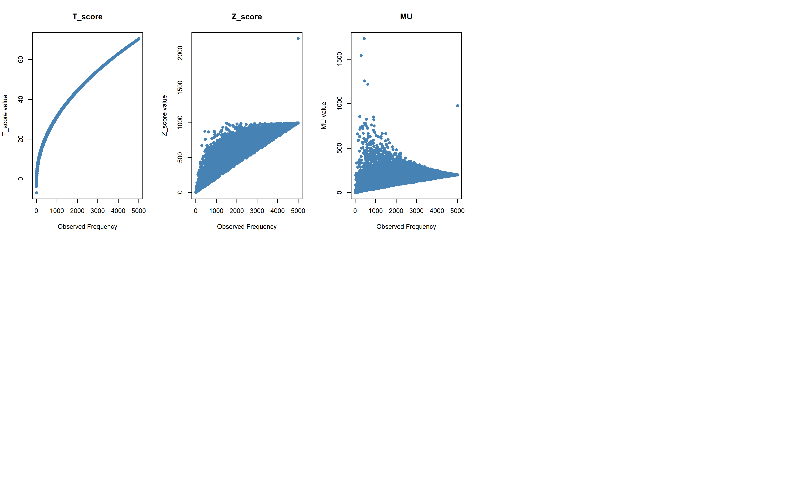
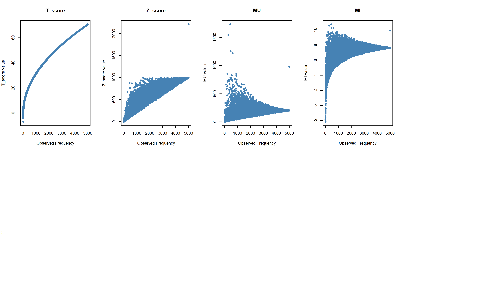
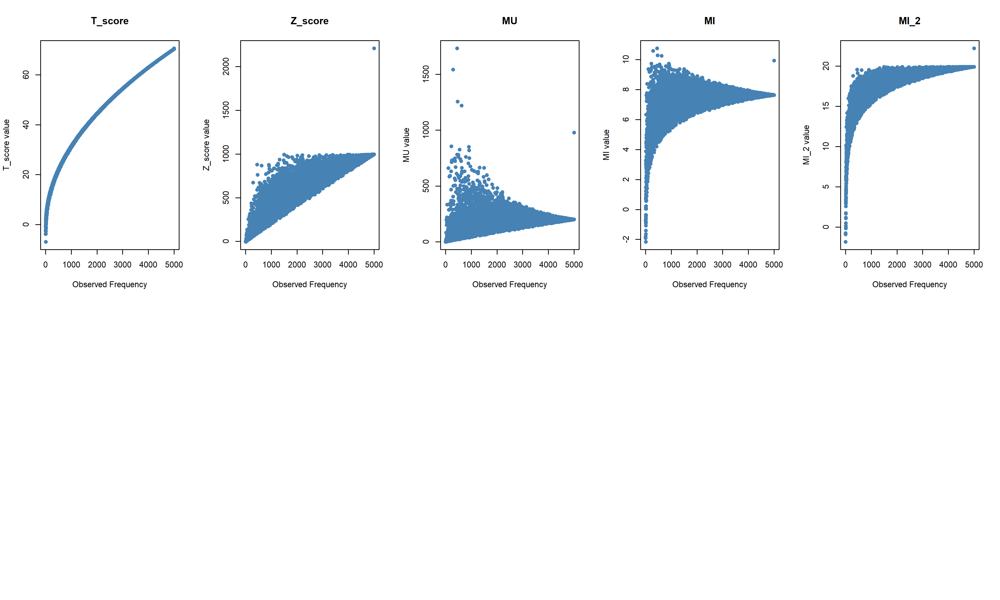
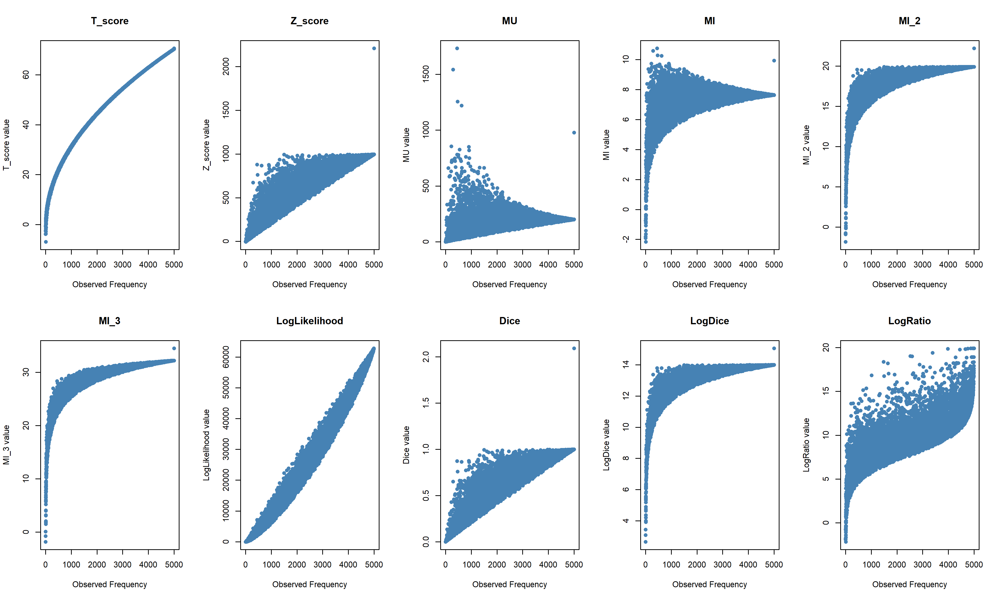
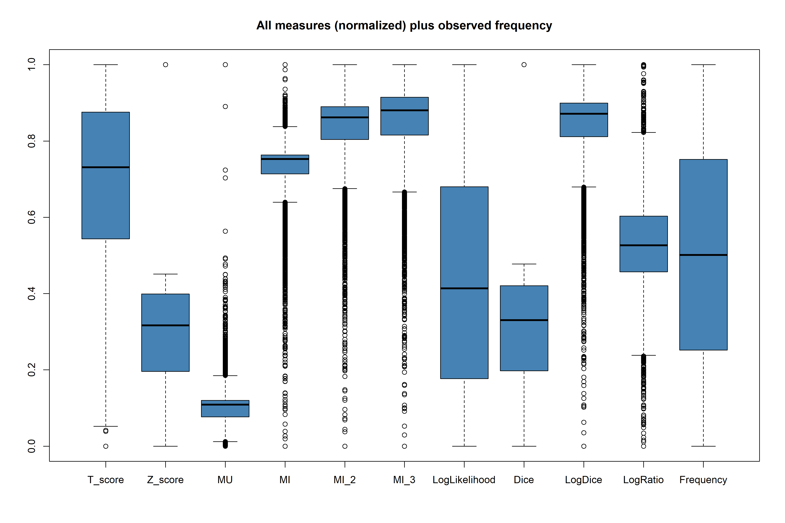
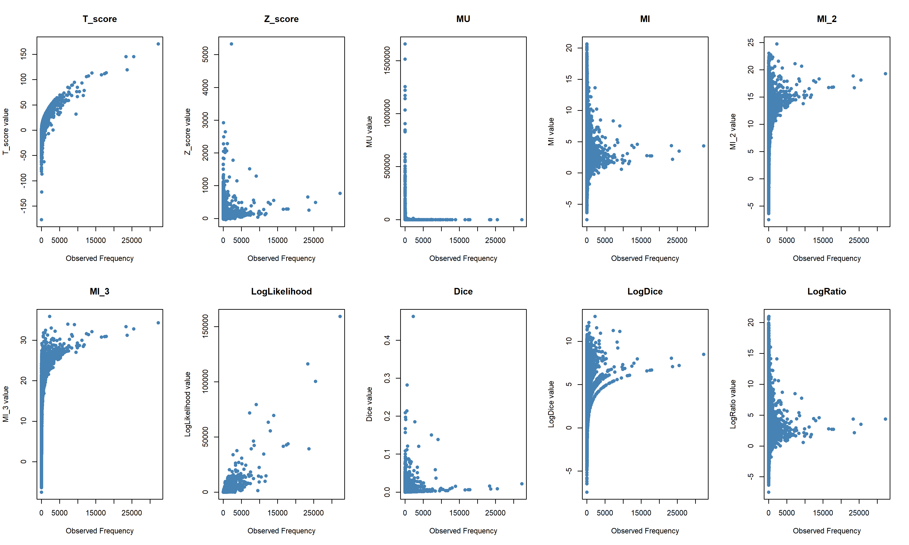
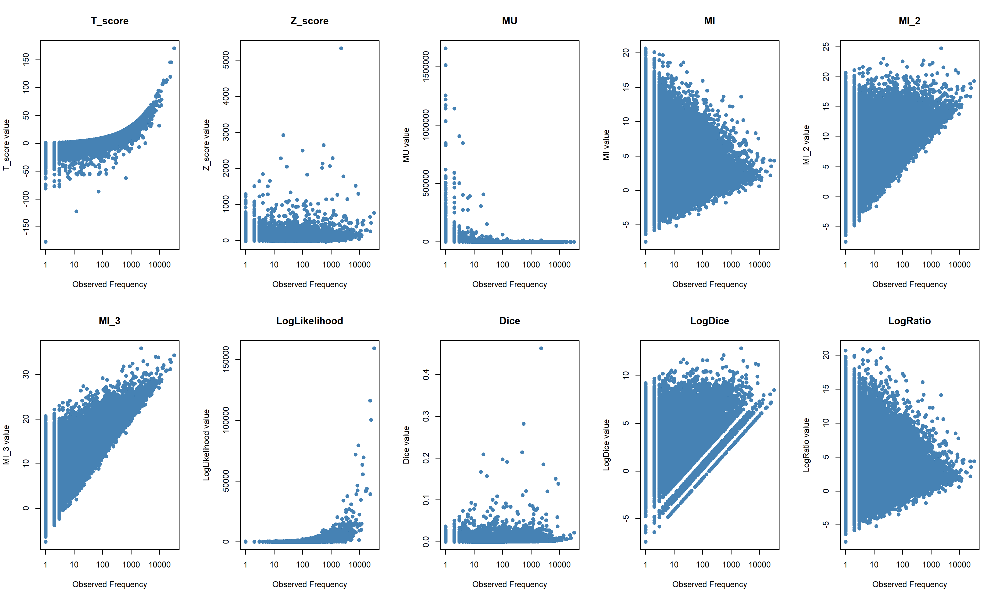
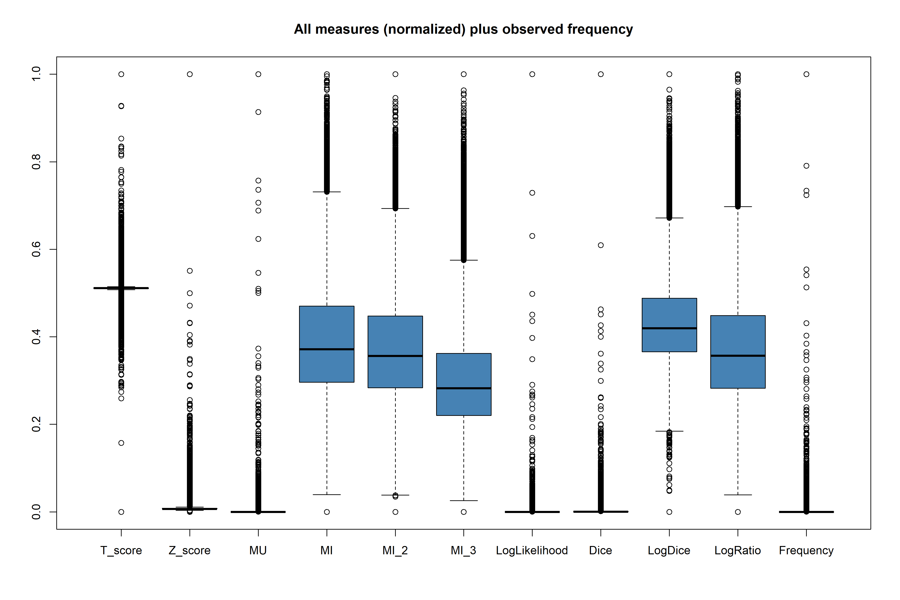

# Introduction

## Goals and Assumptions

**Goals**

::: {.smaller}

- It is not expected that every researchrer writes their own code to calculate association measures
- But it is important to understand the algorithmic approach when implementing AMs 
- This can help to reflect on the various variables and decision points from raw text to measure
- This gives also some insights in understanding why some apparently identical procedures may yield different outcomes

**Assumptions**

- Familiar with Chapter 3 of @Brezina2018
- Some experience with any Corpus Lingustics tool (e.g. #LancsBox, AntConc, SketchEngine, WordSmith, ...)
- Ideally a little exposure to programming

:::

## Why R? - General Remarks

\

::: {.smaller}

Like in many sciences, tansparency, reproducibility and replication remains a challenge in Corpus Linguistics [@Schweinberger2026]. 

Some researchers identify the field as being part of the "replication crisis" (e.g. @Soenning2021, @Schweinberger2025b).

\

R, as an open source language with a broad ecosystem, can facilitate transparent research for reproducible results.

\

This presentation has been created using `R`, with `Positron` as IDE ("Integrated development environment", [https://positron.posit.co/](https://positron.posit.co/)) and the publishing system `quarto` ([https://quarto.org/](https://quarto.org/)), which allows to have executable code in reports or presentations.

:::

# Recap from last Meeting

## Association Measures and Collocation Frequency {.smaller}

How _"sensitive"_ are common measures towards pure collocation frequency?

::: {.r-stack}
{.fragment width="990" height="572"}

{.fragment width="990" height="572"}

{.fragment width="990" height="572"}

{.fragment width="990" height="572"}

{.fragment width="990" height="572"}

{.fragment width="990" height="572"}

:::

## A First Interpretation

::: {.columns}

::: {.column width="15%" style="font-size: 0.6em;"}

Extending the simulation from _t-score_ to other popular measures, we can observe that

- _z-score_ and _Dice_ show a very similar distribution. So does _MI~2~_ and _LogDice_
- _MI_, _MI~2~_ and _MI~3~_ share the same base shape, where the scatter narrows with increasing power
- _Log-Likelihood_ looks like a linear relationship with some variation around the regression line
- _MU_ and _LogRatio_ seem to have the biggest variation 


:::

::: {.column width="78%" style="font-size: 0.6em;"}


:::

:::

::: aside
The scatter plots are created with the same base code as shared in the last meeting, using 10,000 random samples. All plots are build on the same underlying data.
:::

## Measurement Distribution {.smaller}

Normalized between 0 and 1 for all measures.



## Boxplot


::: {.columns}

::: {.column width="15%" .center style="font-size: 0.6em;"}


This is small text

- This is small text
- This is small text
- This is small text


:::

::: {.column width="85%" style="font-size: 0.6em;"}

{width="130%"}

:::

:::

## Boxplot - Grid version

::: {style="display: grid; grid-template-columns: 20% 80%; gap: 20px; align-items: start;"}

::: {style="font-size: 0.6em; text-align: center;"}
**This is small text**

*   Point one
*   Point two
*   Point three
:::

::: {}

:::

:::

## BNC 1994 Data

::: {style="display: grid; grid-template-columns: 20% 80%; gap: 20px; align-items: start;"}

::: {style="font-size: 0.6em; text-align: center;"}
**This is small text**

*   Point one
*   Point two
*   Point three
:::

::: {}



:::
:::


## BNC 1994 Data - log scale

::: {style="display: grid; grid-template-columns: 20% 80%; gap: 20px; align-items: start;"}

::: {style="font-size: 0.6em; text-align: center;"}
**This is small text**

*   Point one
*   Point two
*   Point three
:::

::: {}



:::
:::


## BNC 1994 Data - Boxplot

::: {style="display: grid; grid-template-columns: 20% 80%; gap: 20px; align-items: start;"}

::: {style="font-size: 0.6em; text-align: center;"}
**This is small text**

*   Point one
*   Point two
*   Point three
:::

::: {}



:::
:::


## {.fullplot .smaller}


:::: {.columns}

::: {.column width="30%"}

### Notes

- High-frequency nouns
- Red = R_1 > 5000
- Log-scaled dimensions

:::

::: {.column width="70%"}


```{r}
#| fig-height: 6.5
#| out-width: 100%

# load data
library(readr)
library(dplyr)
library(magrittr)
library(plotly)
bnc1994_nouns <- read_csv("data/sample_150_nouns_collocate.csv",
  show_col_types = FALSE)


top_function_words <- bnc1994_nouns |>
  dplyr::distinct(collocate, .keep_all = TRUE) |>
  dplyr::slice_max(C_1, n = 10) |>
  dplyr::select(collocate, C_1) |>
  dplyr::pull(collocate)

# create color vector
point_colors <- ifelse(bnc1994_nouns$collocate %in% top_function_words,
                       "orange",
                       "steelblue")


q <- plot_ly(
  bnc1994_nouns,
  x = ~R_1,
  y = ~C_1,
  z = ~O_11,
  type = "scatter3d",
  mode = "markers",
  marker = list(
    size = 3,
    color = point_colors
  )
) %>%
  layout(
    margin = list(l = 0, r = 0, b = 0, t = 0),
    # title = "Collocations including top 10 function words",
    scene = list(
      aspectmode = "cube",
      camera = list(
        # eye = list(x = 1.3, y = 1.3, z = 0.9)
        eye = list(x = 1.5, y = 1.5, z = 1)
        ),
      xaxis = list(title = "node frequency"),
      yaxis = list(title = "collocate frequency"),
      zaxis = list(title = "collocation frequency")
    )
  )

q
```

:::
:::


# Sample "Corpus": A Single Text


## A red, red, rose

For this exercise, we will work with the poem 'A red, red rose' by Robert Burns (@Brezina2018, Chapter 3)\
\

::: {style="padding-left: 1em; font-size: 0.75em; font-style: italic; color: #444; line-height: 2;"}
<span style="border: 1px solid #888; padding: 2px 4px; border-radius: 4px;">My **love** is</span> like a red, red rose that’s newly sprung in June: <span style="border: 1px solid #888; padding: 2px 4px; border-radius: 4px;">My **love** is</span> like the melody  
that’s sweetly played in tune. As fair art thou, my bonnie lass, so deep <span style="border: 1px solid #888; padding: 2px 4px; border-radius: 4px;">in **love** am</span> I:  
And I <span style="border: 1px solid #888; padding: 2px 4px; border-radius: 4px;">will **love** thee</span> still, my dear, till a’ the seas gang dry. Till a’ the seas gang dry, my  
dear, and the rocks melt wi’ the sun : And I <span style="border: 1px solid #888; padding: 2px 4px; border-radius: 4px;">will **love** thee</span> still, my dear, while the sands  
o’ life shall run. And fare thee weel, my <span style="border: 1px solid #888; padding: 2px 4px; border-radius: 4px;">only **love**, and</span> fare thee weel a while! And I  
will come again, <span style="border: 1px solid #888; padding: 2px 4px; border-radius: 4px;">my **love**, thou</span>’it were ten thousand mile.
:::

# Text Preparation

## Import Text

We read the text into a string variable:\
\

```{r}
#| label: poem
#| echo: true
#| results: 'asis'

poem <-
  "My love is like a red, red rose that's newly sprung in June:
My love is like the melody that's sweetly played in tune.
As fair art thou, my bonnie lass, so deep in love am I:
And I will love thee still, my dear, till a' the seas gang dry.
Till a' the seas gang dry, my dear, and the rocks melt wi' the sun :
And I will love thee still, my dear, while the sands o' life shall run.
And fare thee weel, my only love, and fare thee weel a while!
And I will come again, my love, thou' it were ten thousand mile."
```


::: aside

There are may ways how data can be read into R, and there are methods for basically all common (and uncommon) formats. For Corpus Linguistics data mostly comes as text (`.txt`) or table (`.csv`) files. 

:::


## Tokenization: Import Library  {auto-animate="true"}

To tokenize the poem, we use the _Penn Treebank word tokenizer_ from the `tokenizers` package [@Mullen2018]. Before we can use the respecting function, we have to download the package using `install.packages("tokenizers")` and import it into our R session.\
\

```{.r}
#| label: tokenize-poem

library(tokenizers)


```

## Tokenization: Call the tokenizer  {auto-animate="true"}

To tokenize the poem, we use the _Penn Treebank word tokenizer_ from the `tokenizers` package [@Mullen2018]. Before we can use the respecting function, we have to download the package using `install.packages("tokenizers")` and import it into our R session.\
\

```{.r}
#| label: tokenize-poem

library(tokenizers)

# create a charter vector of tokens
(poem_tokenized <- tokenize_ptb(poem, simplify = TRUE))
```

## Result produced by the Tokenizer

::: {.compact-code}
```r
  [1] "My"       "love"     "is"       "like"     "a"        "red"      ","        "red"      "rose"     "that"    
 [11] "'s"       "newly"    "sprung"   "in"       "June"     ":"        "My"       "love"     "is"       "like"    
 [21] "the"      "melody"   "that"     "'s"       "sweetly"  "played"   "in"       "tune."    "As"       "fair"    
 [31] "art"      "thou"     ","        "my"       "bonnie"   "lass"     ","        "so"       "deep"     "in"      
 [41] "love"     "am"       "I"        ":"        "And"      "I"        "will"     "love"     "thee"     "still"   
 [51] ","        "my"       "dear"     ","        "till"     "a"        "'"        "the"      "seas"     "gang"    
 [61] "dry."     "Till"     "a"        "'"        "the"      "seas"     "gang"     "dry"      ","        "my"      
 [71] "dear"     ","        "and"      "the"      "rocks"    "melt"     "wi"       "'"        "the"      "sun"     
 [81] ":"        "And"      "I"        "will"     "love"     "thee"     "still"    ","        "my"       "dear"    
 [91] ","        "while"    "the"      "sands"    "o"        "'"        "life"     "shall"    "run."     "And"     
[101] "fare"     "thee"     "weel"     ","        "my"       "only"     "love"     ","        "and"      "fare"    
[111] "thee"     "weel"     "a"        "while"    "!"        "And"      "I"        "will"     "come"     "again"   
[121] ","        "my"       "love"     ","        "thou"     "'"        "it"       "were"     "ten"      "thousand"
[131] "mile"     "."      
```
:::
\
As a next step, some further cleanup is necessary. The code used to do this can be found in the appendix @sec-token-cleaning.

::: aside
Some additional commentary of more peripheral interest.
:::

## Final Result: Clean Tokenized Text

After running the steps outlined in @sec-token-cleaning, we are getting the below results.

This clean text vector will be the basis for our following analysis.

::: {.compact-code}
```r
  [1] "my"       "love"     "is"       "like"     "a"        "red"      "red"      "rose"     "that"     "is"      
 [11] "newly"    "sprung"   "in"       "june"     "my"       "love"     "is"       "like"     "the"      "melody"  
 [21] "that"     "is"       "sweetly"  "played"   "in"       "tune"     "as"       "fair"     "art"      "thou"    
 [31] "my"       "bonnie"   "lass"     "so"       "deep"     "in"       "love"     "am"       "i"        "and"     
 [41] "i"        "will"     "love"     "thee"     "still"    "my"       "dear"     "till"     "a"        "the"     
 [51] "seas"     "gang"     "dry"      "till"     "a"        "the"      "seas"     "gang"     "dry"      "my"      
 [61] "dear"     "and"      "the"      "rocks"    "melt"     "wi"       "the"      "sun"      "and"      "i"       
 [71] "will"     "love"     "thee"     "still"    "my"       "dear"     "while"    "the"      "sands"    "o"       
 [81] "life"     "shall"    "run"      "and"      "fare"     "thee"     "weel"     "my"       "only"     "love"    
 [91] "and"      "fare"     "thee"     "weel"     "a"        "while"    "and"      "i"        "will"     "come"    
[101] "again"    "my"       "love"     "thou"     "it"       "were"     "ten"      "thousand" "mile"    
```
:::

## Summary Tokenization
**Points to Consider**

The way tokenization is performed has a significant influence on the association measure results, even for segmented languages like English. Main sources of variation include:

::: {.fragment fragment-index=1}
::: {.nonincremental}
- Hyphenated words (e.g. `daughter-in-law` vs. `daughter`, `in`, `law`)
- Multiword expressions (e.g. `Supervisory Board` vs. `Supervisory`, `Board`)
- Clitics (`That's` vs `That`, `'s`)
- Abbreviations (e.g. `U.K.` often becomes `U`, `K`)
:::
:::

::: {.fragment fragment-index=2}
=> Difference in token counts varay across tools and methods used [@brezina2017large]. Transparency and consistency is key. 
:::

# Construct Contingency Tables

## Observed and Expected Tables

::: {.smaller}
To construct the full set of data in the two tables, we have 14 values to consider.
:::

::: {.columns style="font-size: 0.4em;"}

::: {.column width="35%"}

::: {.fragment fragment-index=1}
### Observed Frequencies
| | Collocate present (my) | Collocate absent | Totals |
| :--- | :---: | :---: | :---: |
| **Node present (love)** |$O_{11}$ | $O_{12}$ | **$R_1$** |
| **Node absent** | $O_{21}$ | $O_{22}$ | **$R_2$** |
| **Totals** | **$C_1$** | **$C_2$** | **$N$** |
:::

:::

::: {.column width="15%"}
:::

::: {.column width="50%"}

::: {.fragment fragment-index=2}
### Expected Frequencies 
| | Collocate present (my) | Collocate absent | Totals |
| :--- | :---: | :---: | :---: |
| **Node present (love)** | $E_{11} = \frac{R_1 \times C_1}{N}$ | $E_{12} = \frac{R_1 \times C_2}{N}$ | **$R_1 \times w$** |
| **Node absent** | $E_{21} = \frac{R_2 \times C_1}{N}$ | $E_{22} = \frac{R_2 \times C_2}{N}$ | **$R_2$** |
| **Totals** | **$C_1$** | **$C_2$** | **$N$** |
:::

:::

:::

\

::: {.smaller}

::: {.fragment fragment-index=3}
It looks like a _lot_ to calculate. Lucily, only need the following 5 values:
:::

::: {.fragment fragment-index=4}
(a) Number of tokens in the whole corpus: $N$
:::

::: {.fragment fragment-index=5}
(b) Frequency of the node in the whole corpus: $R_1$
:::

::: {.fragment fragment-index=6}
(c) Frequency of the collocate in the whole corpus: $C_1$
:::

::: {.fragment fragment-index=7}
(d) Frequency of the collocation (i.e. node + collocate) in the collocation window: $O_{11}$
:::

::: {.fragment fragment-index=8}
(e) Collocation window size: $w$ (can be symmetric or asymmetric)
:::

:::

## Observed and Expected Tables

::: {.smaller}
To construct the full set of data in the two tables, we have 14 values to consider.
:::

::: {.columns style="font-size: 0.4em;"}

::: {.column width="45%"}


### Observed Frequencies
| | Collocate present (my) | Collocate absent | Totals |
| :--- | :---: | :---: | :---: |
| **Node present (love)** |<span class="highlight-cell">$O_{11}$</span> | $O_{12} = R_1 - O_{11}$ | <span class="highlight-cell">$R_1$</span> |
| **Node absent** | $O_{21} = C_1 - O_{11}$ | $O_{22} = R_2 - O_{21}$ | **$R_2 = N - R_1$** |
| **Totals** | <span class="highlight-cell">$C_1$</span> | **$C_2 = N - C_1$** | <span class="highlight-cell">$N$</span> |


:::

::: {.column width="5%"}
:::

::: {.column width="50%"}


### Expected Frequencies 
| | Collocate present (my) | Collocate absent | Totals |
| :--- | :---: | :---: | :---: |
| **Node present (love)** | $E_{11} = \frac{R_1 \times C_1}{N}$ | $E_{12} = \frac{R_1 \times C_2}{N}$ | **<span class="highlight-cell">$R_1$</span>$\times w$** |
| **Node absent** | $E_{21} = \frac{R_2 \times C_1}{N}$ | $E_{22} = \frac{R_2 \times C_2}{N}$ | **$R_2$** |
| **Totals** | <span class="highlight-cell">$C_1$</span> | **$C_2$** | <span class="highlight-cell">$N$</span> |


:::

:::

\

::: {.smaller}

In other words, we do have to determine


::: {.fragment fragment-index=1}
(1) four _tallied_ values, extracted from the corpus data
:::

::: {.fragment fragment-index=2}
(2) one _parameter_, decided by the researcher (if window size correction is applied)
:::

::: {.fragment fragment-index=3}
(3) nine _calculated_ values, applying some arithmetic to (1) and (2) 
:::

:::


## Determine Tallied Values (1/4)

```{r}
#| label: prepare-tokens
#| echo: false

library(tokenizers)
poem_tokenized <- tokenize_ptb(poem, simplify = TRUE)
poem_tokens <- poem_tokenized |>
  paste(collapse = " ") |>
  gsub(pattern = "'s\\b", replacement = " is ") |>
  gsub(pattern = "[[:punct:]]", replacement = "") |>
  tolower() |>
  (\(x) strsplit(x, "\\s+")[[1]])()

# print(poem_tokens)
```

:::{.smaller}

Most of the values we need can be calculated straightforward from the token vector we have created earlier.

The Number of tokens in the whole corpus, $N$, equals the number of elements in our vector, which can be derived using the `length()` function:

:::

```{r}
#| echo: true

# Number of tokens
(N <- length(poem_tokens))
```

:::{.smaller}

For the frequency of the node ($R_1$), we can ask which token is equal to the node, using the expression `poem_tokens == "love"`. Note that `==` means "equal to" in many programming languages - like a single `=` in maths. This gives us a _logical_ vecor of `TRUE` and `FALSE`'s. Since `TRUE` corresponds to `1` and `FALSE` to `0`, we can simply sum it up and have the result we need:

:::

```{r}
#| echo: true

# Frequency of node
node <- "love"
(R_1 <- sum(poem_tokens == "love"))
```

## Determine Tallied Values (2/4)

:::{.smaller}

Likewise for the collocate of interest, $C_1$:

:::

```{r}
#| echo: true

# Frequency of collocate of interest
collocate <- "my"
(C_1 <- sum(poem_tokens == "my"))
```

:::{.smaller}

The window size is our choice and depends on the research question.

:::

```{r}
#| echo: true

# Window size
(window_size <- 2)
```


## Determine Tallied Values (3/4)

:::{.smaller}

For determining the collocation, we need to count - or better make the computer count - not just a sum, but what positional values the node and its collocate has. Usually we want to identify all collocates of our node of interest and how often they occur in our text (corpus).

First, we need to find the positions of our node. We can do so with the function `which()`. It returns a numeric vector of the node positions in the token vector

:::

```{r}
#| echo: true

# Node positions
(node_positions <- which(poem_tokens=="love"))
```

:::{.smaller}

Since we decided for a $L_1$/$R_1$ window, we can take the above vector add and subtract 1, respectively, to determine the positions of the co-occurrences:

:::

```{r}
#| echo: true

# get the position numbers of L1 and R1
left_positions <- node_positions - 1
right_positions <- node_positions + 1
# combine the two vectors
all_positions <- c(left_positions, right_positions)

# sort it nicely for us
sort(all_positions)
```

## Determine Tallied Values (4/4)

:::{.smaller}
Having the numerical values of the collocate positions in the text vector, we can use this as a filter to retrieve the tokens of interest:
:::

```{r}
#| echo: true

(all_collocates <- poem_tokens[all_positions])
```

:::{.smaller}
To summarize this, we apply the `table()` function:
:::

```{r}
#| echo: true

table(all_collocates)
```

:::{.smaller}
To extract only the numerical value of our collocate of interest, we `subset` this table using double brackets (`[[]]`):
:::

```{r}
#| echo: true

(O_11 <- table(all_collocates)[["my"]])
```


# Determine Calculated Values

## Compute Observed and Expected

::: {.smaller}

Computing the remaining values for constructing the observed and expected table can be easlily done with applying simple arithmetic:

:::

::: {.fragment fragment-index=1}
```{r}
#| echo: true
# remaining observed frequency values
O_12 <- R_1 - O_11
O_21 <- C_1 - O_11
R_2 <- N - R_1
C_2 <- N - C_1
O_22 <- R_2 - O_21
```
:::

::: {.fragment fragment-index=2}
::: {.smaller}
**Note**: expected frequencies can be calculated with correction for window size or without. Here, we do *not* correct for window size. 

:::
:::

::: {.fragment fragment-index=3}

```{r}
#| echo: true
# Calculate expected values without correction
E_11 <- (R_1 * C_1) / N
E_21 <- (R_2 * C_2) / N
E_12 <- (R_1 * C_2) / N
E_22 <- (R_2 * C_2) / N
```


:::

# Calculate Association Measures

## MU, MI, Dice, LogRatio

Calculating Association Measures which are based on observed/ecpected frequencies is now straightforward. 


:::: {.columns}

::: {.column width="45%"}
**MU**

```{r}
#| echo: true

(MU <- O_11 / E_11)
```

\

**MI**

```{r}
#| echo: true

(MI <- log2(O_11 / E_11))
```

:::

::: {.column width="10%"}

:::

::: {.column width="45%"}
**Dice**

```{r}
#| echo: true

(Dice <- (2 * O_11) / (R_1 + C_1))
```

\

**LogRatio**

```{r}
#| echo: true

(LogRatio <- 
  log2((O_11 * R_2) / (O_21 * R_1)))
```

:::
:::

::: aside

The formulae of these measures are listed in @sec-ai-formulae.

:::


# Compare Association Measures

## All Measures table

```{r}
#| label: calculate-all-am
#| echo: false


source("R/collocates_brezina.R")

# run custom function
result <- collocates(
  list(poem_tokens),   # the corpus to be analysed
  node = "love",       # the node of interes
  left = 1,            # left window size
  right = 1,           # right window size
  to_lower = FALSE,    # lower case
  #measures = "all",    # all measures from above
  measures = c("MU", "MI", "MI2", "MI3", "LL_short", "Z-score", 
                "T-score", "Dice", "LogDice", "LogRatio"),
  corrected = FALSE    # formula correction for window size
)


# Round all measures to 2 decimal places
# result[, 4:11] <- round(result[, 4:17], 2)
names(result) <- c("token", "f_collocation", "f_collocate", "MU", "MI", 
            "MI2", "MI3", "LogL", "Z_score", "T_score", "Dice", "LogDice", "LogRatio")

names(result) <- c("collocate", "O_11", "C_1", "MU", "MI", 
            "MI2", "MI3", "LogL", "Z_score", "T_score", "Dice", "LogDice", "LogRatio")

result <- result[order(result$MU, decreasing = TRUE), ]
```

```{r}
#| label: ranked-table
#| warning: false
#| message: false

library(dplyr)

# Get the numeric column names (all except "collocate")
numeric_cols <- names(result)[2:13]  # "O_11", "C_1", "MU", ... "LogRatio"

# Build a wide ranked table: for each metric, rank collocates descending
ranked_result <- as.data.frame(
  lapply(setNames(numeric_cols, numeric_cols), function(col) {
    result$collocate[order(result[[col]], decreasing = TRUE)]
  })
)

ranked_result <- ranked_result |>
    select(O_11, MI3, T_score, MU, MI, Dice, LogDice, LogRatio, LogL, MI2, Z_score, C_1)

# LogRatio requires manual sorting because of the NaN values
ranked_result$LogRatio <- c("will", "is", "thee", "thou", "my", "in", "and", "am", "only")

```


::: {.panel-tabset}

### <span style="font-size:0.7em;">Numerical Values</span>

```{r}
#| label: dt-table-to-display

library(DT)

result |>
  DT::datatable(
    caption = "Collocates of \"love\"",
    filter = "top",
    options = list(
      # only list the table, and not the search box
      dom = 't',
      # This scales the header and body text
      initComplete = JS(
        "function(settings, json) {",
        "$(this.api().table().container()).css({'font-size': '11pt'});",
        "}"
      )
    )
  ) |>
  DT::formatRound(columns = 4:13, digits = 2) |>
  DT::formatStyle(
    columns = c("collocate"),
    fontWeight = 'bold',
    `text-align` = 'left'
  ) |>
  DT::formatStyle(columns = c("O_11", "C_1"), `text-align` = 'center')
```

### <span style="font-size:0.7em;">Collocation Ranking</span>

```{r}
#| label: dt-ranked-collocates

ranked_result |>
  DT::datatable(
    caption = "Collocates of \"love\"",
    options = list(
      searching = FALSE,  # Removes search box
      ordering = FALSE,   # Removes sort arrows and disables sorting
      paging = FALSE,     # Removes pagination
      info = FALSE,       # Removes "Showing X of Y" text
      rowCallback = JS(
        "function(row, data, index) {",
        "  // 1. Logic for highlighting 'my'",
        "  for (var i = 0; i < data.length; i++) {",
        "    if (typeof data[i] === 'string' && data[i].toLowerCase().includes('my')) {",
        "      var cell = $('td:eq(' + i + ')', row);",
        "      cell.css('font-weight', 'bold');",
        "      cell.css('background-color', '#fff9c4');",
        "    }",
        "  }",
        "",
        "  // 2. Logic for the NaN values",
        "  if (index === 7 || index === 8) {",
        "    var targetCols = [8, 9]; ",
        "    targetCols.forEach(function(colIdx) {",
        "      var cell = $('td:eq(' + colIdx + ')', row);",
        "      cell.css('text-decoration', 'line-through');",
        "      cell.css('color', '#a9a9a9');",
        "    });",
        "  }",
        "}"
      ),
      initComplete = JS(
        "function(settings, json) {",
        "  var tableContainer = $(this.api().table().container());",
        "  ",
        "  // Apply your font size",
        "  tableContainer.css({'font-size': '11pt'});",
        "  ",
        "  // Apply thick vertical lines between col 3/4 and col 4/5",
        "  // If you have row names, use nth-child(4) and (5). ",
        "  // If rownames = FALSE, use nth-child(3) and (4).",
        "  tableContainer.find('td:nth-child(4), th:nth-child(4)').css('border-right', '2px solid gray');",
        "  tableContainer.find('td:nth-child(6), th:nth-child(6)').css('border-right', '2px solid grey');",
        "  tableContainer.find('td:nth-child(8), th:nth-child(8)').css('border-right', '2px solid grey');",
        "  tableContainer.find('td:nth-child(12), th:nth-child(12)').css('border-right', '2px solid grey');",
        "}"
      )
    )
  )
```
:::


## Edge Cases

:::{.smaller}

There are some instances which require special treatment 

:::

\

::: {.columns style="font-size: 0.4em;"}

::: {.column width="30%"}

### Measure Limitations

1-to-1 relationship of node and collocate:

| | Collocate present | Collocate absent | Totals |
| :--- | :---: | :---: | :---: |
| **Node present** |1 | $O_{12}$ | **$R_1$** |
| **Node absent** | 0 | $O_{22}$ | **$R_2$** |
| **Totals** | 1 | **$C_2$** | **$N$** |

\

**Division by zero**

$$LogRatio = \log_{2} \frac{O_{11} \times R_2}{O_{21} \times R_1} = \log_{2} \frac{1 \times R_2}{0 \times R_1}$$

**Log of zero**

Part of LL formula - Log of zero is undefined

$$O_{21} \times \ln(\frac{O_{21}}{E_{21}}) = 0 \times \ln(\frac{0}{E_{21}}) $$

:::

::: {.column width="5%"}

:::

::: {.column width="30%"}

### Self-collocation

A sentence with an _epizeuxis_ like:

<blockquote>
"There are three things that matter in property: **location**, **location**, **location**."
</blockquote>

<p align="right">— _Attributed to Lord Harold Samuel (1944)_</p>

\

Produces a self-collocation table as below: 

| | Collocate present | Collocate absent | Totals |
| :--- | :---: | :---: | :---: |
| **Node present** |4 | 1 | **5** |
| **Node absent** | -1 | $O_{22}$ | **$R_2$** |
| **Totals** | 3 | **$C_2$** | **$N$** |

:::

::: {.column width="5%"}

:::

::: {.column width="30%"}

### Overlapping windows

A sentence with an _epistrophe_ like:

<blockquote>
We want to build **growth**, significant **growth**, sustainable **growth**, rooted in our core capabilities.
</blockquote>

returns the following $L_1$/$R_1$ constructs: 

- build **growth** significant

- significant **growth** sustainable

- sustainable **growth** rooted

Which results in the following values for the collocate _sustainable_:

| | Collocate present | Collocate absent | Totals |
| :--- | :---: | :---: | :---: |
| **Node present** |2 | $O_{12}$ | **3** |
| **Node absent** | -1 | $O_{22}$ | **$R_2$** |
| **Totals** | 1 | **$C_2$** | **$N$** |

:::

:::


## Summary: the Algorithmic Approach

Bla Bla Bla


## Thank you

\

Please feel free to reach out to me if you have any questions.

Also, I appreciate any comments and suggestions regarding this material or Corpus Linguistics in general.

\
\

<center>Olaf Presanis</center>  

<center>opresanis@gmail.com</center>

<center><a href="mailto:someone@example.com">Send Email</a></center>

<center><a href="mailto:opresanis@gmail.com">opresanis@gmail.com</a></center>

# Appendix

## Further reading

:::{.smaller}

Starting point of your learning journey in statistics and R for Corpus linguistics should be @Brezina2018. This book will give you a solid overview about statistical concepts used in the field. Especially on Collocations, see also @Brezina2015.

Also, the work of Stefan Gries in recommended, in particular @Gries2016, which is a good hands-on introduction into R and its application to case studies. With a broader focus on linear and mixed models, @Gries2021. Both give a solid and ridgid introduction into working with R in (Corpus) Linguistics. 

The _Practical Handbook of Corpus Linguistics_ @Paquot2020 offers an overview on many aspects in Corpus Linguistics research, from corpus compilation to writing a research report. Part II focuses on Corpus methods (with Chapter 7 on _Co-occurrence Data_, like Collocations [@Gries2020]) and Part IV on technical aspects, like programming with R.

There are many other introductions to be considered, for example Bodo Winter -@Winter2019. He gives an introduction based on the `tidyverse` dialect of R (other than Gries, who sticks to `base R`) before diving into linear models and inferrential statistics. Slightly earlier work of Guillaume Desagulier -@Desagulier2017 but likewise a good introduction to the topic.  

:::

## Measures Discussed in this Presentation {#sec-ai-formulae}


::: {.columns style="font-size: 0.6em;"}

::: {.column width="33%"}
_**MU**_ [@evert2004phd]

$MU = \frac{O_{11}}{E_{11}}$

\

_**(pointwise) Mutual Information**_ [@Church1990]

$MI = \log_{2}{\frac{O_{11}}{E_{11}}}$

:::

::: {.column width="33%"}

_**MI~2~**_ [@Daille1995]

$MI = \log_{2}{\frac{O_{11}^2}{E_{11}}}$

\

_**MI~3~**_ [@Daille1995]

$MI = \log_{2}{\frac{O_{11}^3}{E_{11}}}$

:::

::: {.column width="33%"}

_**Dice**_ [@Smadja1993]

$Dice = \frac{2 \times O_{11}}{R_1 + C_1}$

\

_**LogDice**_ [@Rychlỳ2008]

$LogDice = 14 + \log_{2} \frac{2 \times O_{11}}{R_1 + C_1}$

\

_**LogRatio**_ [@Hardie2014]

$LogRatio = \log_{2} \frac{O_{11} \times R_2}{O_{21} \times R_1}$

:::

:::


## Measures Discussed in this Presentation (2/2)


::: {.columns style="font-size: 0.6em;"}

::: {.column width="66%"}
_**Log-Likelihood**_ [@Rayson2004]

$LogLikelihood =  2 \times \left( \begin{aligned} 
  &O_{11} \times \log(O_{11} / E_{11}) + O_{21} \times \log(O_{21} / E_{21}) \\ 
  + &O_{12} \times \log(O_{12} / E_{12}) + O_{22} \times \log(O_{22} / E_{22}) 
\end{aligned} \right)$


:::

::: {.column width="33%"}
_**T-score**_ [@Stubbs1995]

$t-score = \frac{(O_{11} - E_{11})}{\sqrt{O_{11}}}$

_**Z-score**_

$z-score = \frac{(O_{11} - E_{11})}{\sqrt{E_{11}}}$


:::

:::


## Additional Cleaning of Tokenized Text {#sec-token-cleaning}

```{.r}
# Step 1: Concatenate the vector into a single string
poem_string <- paste(poem_tokenized, collapse = " ")

# Step 2: Replace the token "'s" with "is"
poem_string <- gsub("'s\\b", " is ", poem_string)

# Step 3: Remove all punctuation
poem_string <- gsub("[[:punct:]]", "", poem_string)

# Step 4: make all words lowercase
poem_string <- tolower(poem_string)

# Step 5: Split the cleaned string back into a vector of words
# on any white space character as delimiter
poem_tokens <- strsplit(poem_string, "\\s+")[[1]]
```

# References

